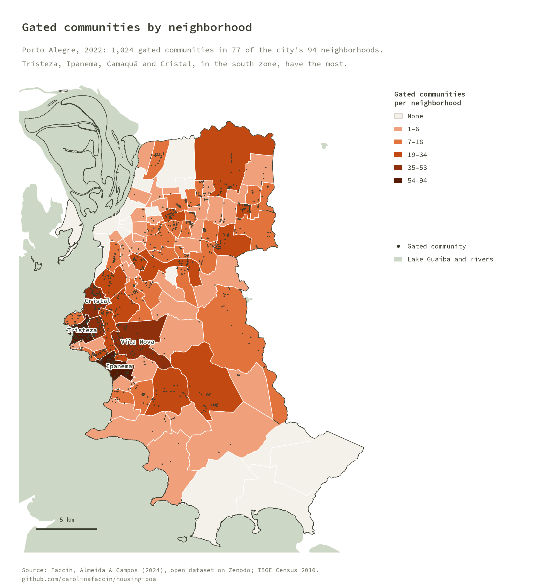
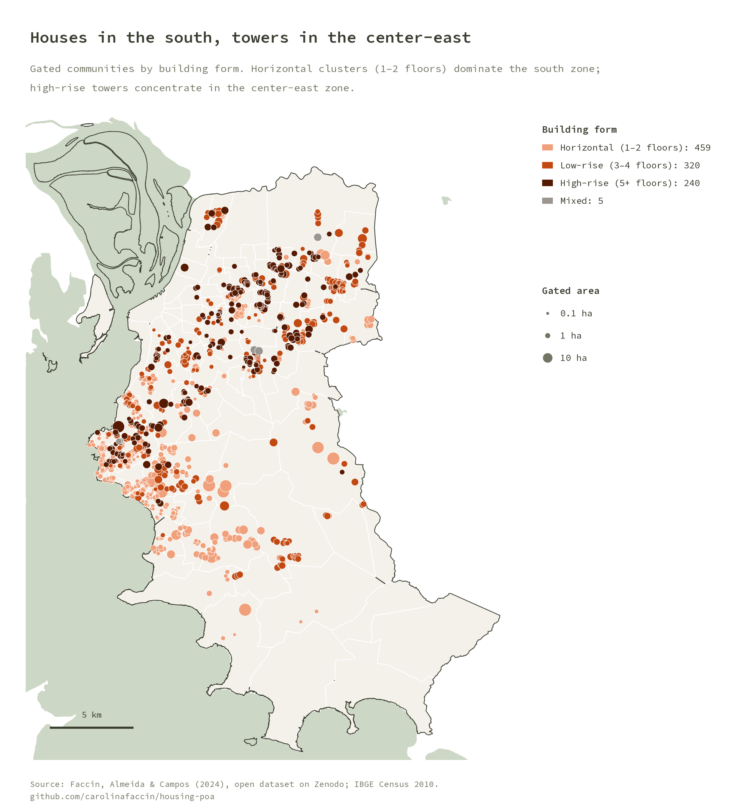
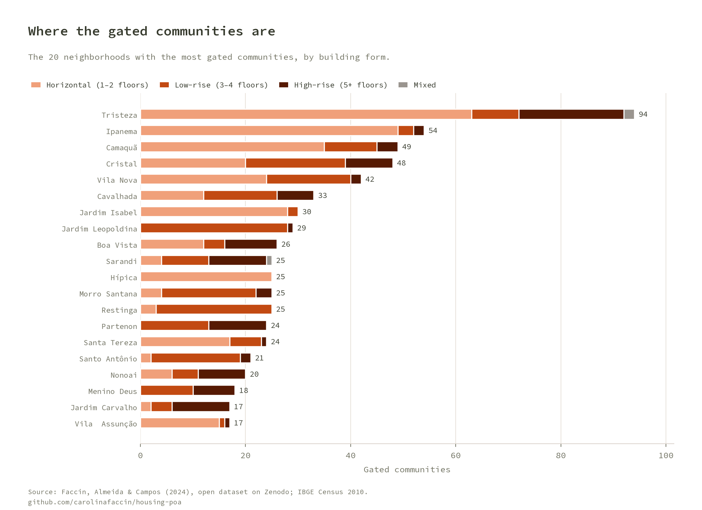
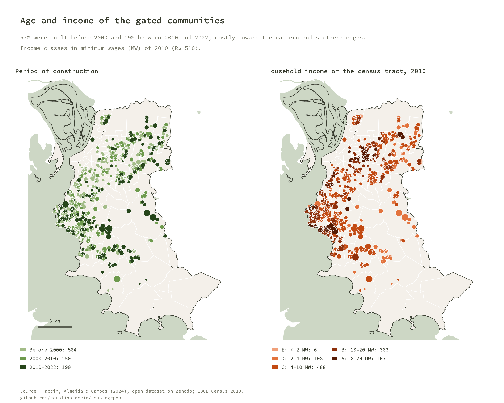
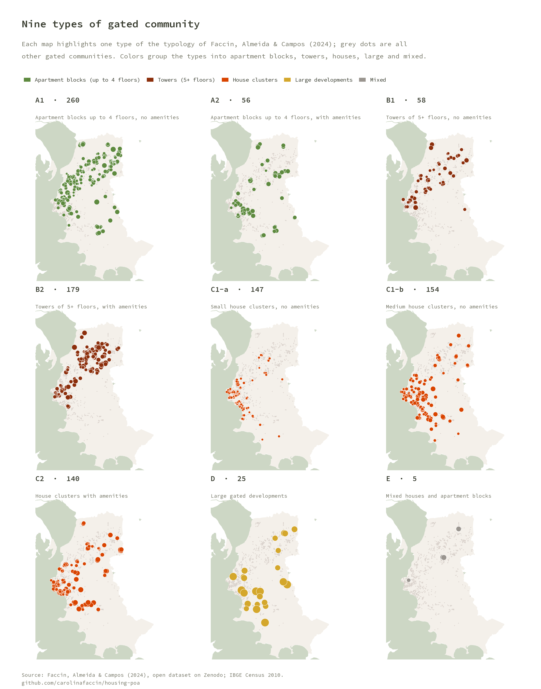
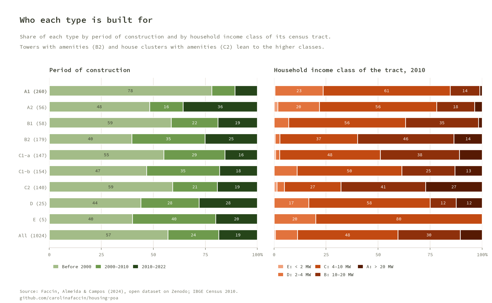
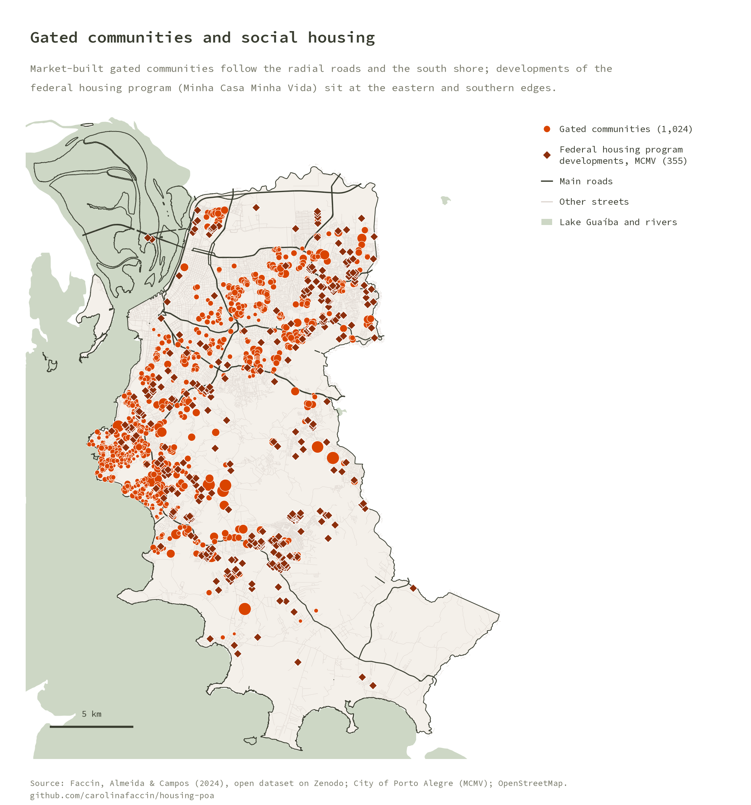
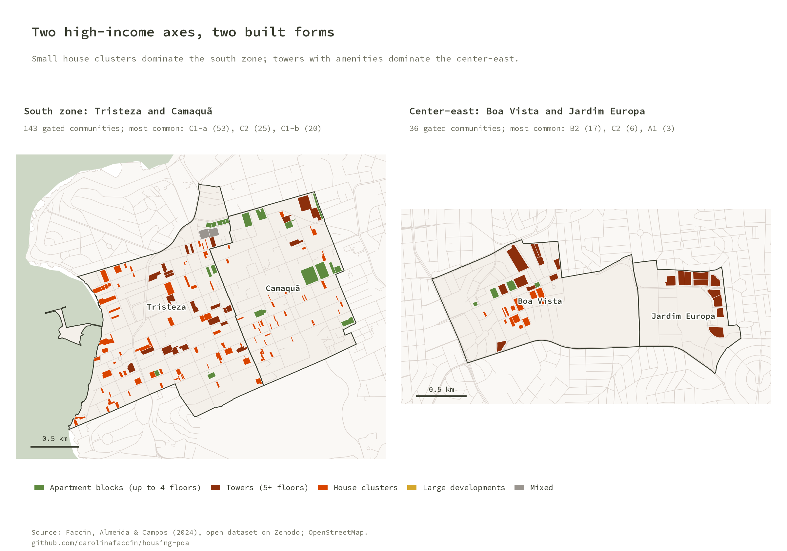
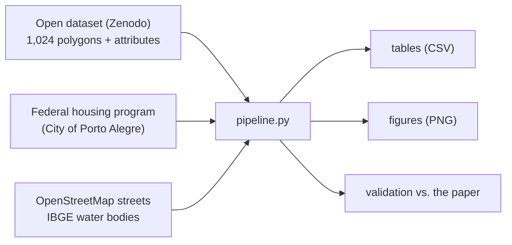

# HOUSING-POA

**Gated communities in Porto Alegre, Brazil.** A reproducible analysis of the open dataset of the 1,024 gated residential communities ("condomínios fechados") mapped in Porto Alegre in 2022, with their typology, period of construction and the income of their surroundings.

It rebuilds, in Python, the analysis behind the paper
[*Morfologia urbana e tipologia de condomínios fechados na metrópole de Porto Alegre–RS*](https://doi.org/10.11606/issn.2317-2762.posfauusp.2024.226515)
(Faccin, Almeida & Campos, 2024) and checks it against the numbers the paper reports. The dataset is open on [Zenodo](https://doi.org/10.5281/zenodo.17023731).

## Key results

- **1,024 gated communities in 77 of the city's 94 neighborhoods.** 459 are horizontal (houses), 560 vertical (apartment blocks and towers) and 5 mixed.
- **Houses in the south, towers in the center-east.** Tristeza (94), Ipanema (54), Camaquã (49) and Cristal (48), in the south zone, have the most gated communities, mostly clusters of houses; the center-east zone concentrates towers.
- **Nine types.** Low-rise apartment blocks without amenities (A1, 260) are the most common type; towers with amenities (B2, 179) come second.
- **Amenities follow income.** Towers with amenities (B2) and house clusters with amenities (C2) sit in the richest census tracts: 60% and 68% of them are in tracts of classes A or B (household income above 10 minimum wages in 2010).
- **Still growing.** 57% were built before 2000 and 19% between 2010 and 2022; low-rise blocks with amenities (A2) are the type that grew most recently (36% built after 2010).

## Figures

















## How it works



1. **Dataset.** The gated-community polygons and neighborhoods are read from `dataset_dir`; if the files are missing they are downloaded from Zenodo.
2. **Attributes.** Each community carries its building form, size, period of construction (read from Google Earth images of 2002, 2012 and 2022), amenities and the income of the census tract it overlaps most (IBGE Census 2010).
3. **Typology.** Nine types (A1 to E) combine building form, amenities and size, following the paper.
4. **Tables.** Counts by type, neighborhood and form; shares by period of construction and income class.
5. **Context layers (optional).** Federal housing program developments (Minha Casa Minha Vida) and Lake Guaíba come from the local `raw_dir`; streets are downloaded from OpenStreetMap once and cached. Figures that need a missing layer are drawn without it.

## Run it

```bash
python -m venv venv && source venv/bin/activate
pip install -r requirements.txt
cp config/config.local.json.example config/config.local.json   # set the folders
python pipeline.py                               # tables + figures + README images
python pipeline.py --only figures docs           # redraw figures only
pytest                                           # unit tests + validation against the paper
```

`config/config.local.json` (gitignored) sets three folders:

| Key | Purpose |
|---|---|
| `dataset_dir` | The open dataset. Downloaded from Zenodo when empty |
| `raw_dir` | Optional. Shared raw-data catalog with the federal housing program layer (`prefeituras_municipais/porto_alegre/mcmv_2/`) and IBGE water bodies (`ibge/hidrografia/2017/`) |
| `data_dir` | This project's outputs: `tables/`, `figures/`, `cache/` |

## Outputs (`data_dir`)

| File | Content |
|---|---|
| `tables/types.csv` | Count, gated area and median size by type |
| `tables/types_by_period.csv`, `types_by_income.csv` | Shares by period of construction and income class, per type (the paper's Quadro 2) |
| `tables/neighborhoods.csv` | Count by neighborhood and building form |
| `tables/validation.csv` | Computed vs. published counts |
| `tables/income_vs_paper.csv` | Income-class shares, computed vs. published |
| `figures/*.png` | All figures (copied to `docs/img/` for this README) |

## Validation

`pipeline.py` stops with an error if a count drifts by more than one from the published value.

| Check | Published | Computed |
|---|---|---|
| Gated communities | 1,024 | 1,024 |
| Horizontal / vertical / mixed | 459 / 560 / 5 | 459 / 560 / 5 |
| Neighborhoods with gated communities | 76 | 77 |
| Built before 2000 / 2000–2010 / 2010–2022 | 585 / 250 / 189 | 584 / 250 / 190 |
| Small / medium / large | 173 / 826 / 25 | 172 / 827 / 25 |
| Types A1, A2, B1, B2, C2, D, E | 260, 56, 58, 179, 140, 25, 5 | same |
| Types C1-a / C1-b | 148 / 153 | 147 / 154 |
| Tristeza / Camaquã | 94 / 49 | 94 / 49 |

A few counts differ by one between the published dataset and the paper; they are within the tolerance.

**Income classes are close but not identical.** The paper's income shares (A 8%, B 25%, C 47%, D 16%, E 3%) cannot be fully rebuilt from the published attributes; the household income of the tract in the dataset gives A 10.6%, B 29.9%, C 48.2%, D 10.7%, E 0.6%. The class C share, the paper's main finding, matches. This comparison is reported in `income_vs_paper.csv` and is not enforced.

## Repository layout

```
pipeline.py            orchestrator (tables, figures, docs)
src/housing/
  config.py            paths from config/config.local.json
  data.py              dataset download and loading, typology labels
  metrics.py           tables and validation against the paper
  osm.py               OpenStreetMap streets (Overpass API, cached)
  figures.py, style.py figures in the project's visual identity
tests/                 synthetic unit tests + validation against the paper
assets/fonts/          Source Code Pro (SIL OFL)
```

## Credits

Paper: Faccin, C. R.; Almeida, N. B. L.; Campos, H. A. (2024). *Morfologia urbana e tipologia de condomínios fechados na metrópole de Porto Alegre–RS.* PosFAUUSP, 31(59), e226515.

Data: [open dataset on Zenodo](https://doi.org/10.5281/zenodo.17023731), [IBGE](https://www.ibge.gov.br/), City of Porto Alegre and [OpenStreetMap](https://www.openstreetmap.org/copyright) contributors (ODbL). Figures use the Source Code Pro typeface (SIL Open Font License).

## License

GNU General Public License v3.0, see [LICENSE](LICENSE).
